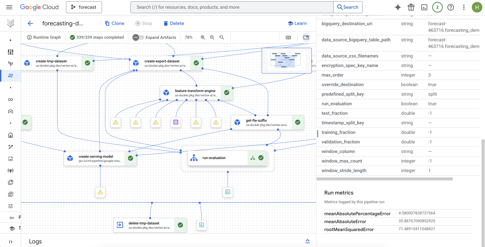
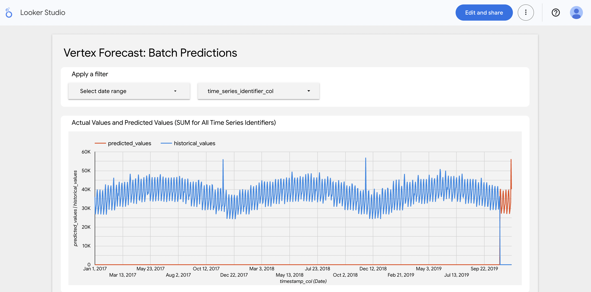

# ARIMA\_PLUS Time Series Forecasting with Vertex AI & BigQuery ML

This project demonstrates how to build and deploy a driver-based time series forecasting pipeline using **Vertex AI Pipelines**, **BigQuery ML**, and the **ARIMA\_PLUS** model for retail sales prediction.

Driver-based forecasting refers to models that use external influencing factors (called drivers), such as promotions, holidays, or weather, in addition to historical data to predict future outcomes.

Link to GCP Tutorial: https://github.com/GoogleCloudPlatform/vertex-ai-samples/blob/main/notebooks/official/tabular_workflows/bqml_arima_plus.ipynb

---

## 🧠 Model Overview: What is ARIMA\_PLUS?

**ARIMA\_PLUS** is an extended version of the classic ARIMA model supported by **BigQuery ML**. It supports:

* **Time series decomposition** into trend, seasonal, holiday effects, etc.
* **External regressors (drivers)** like advertising and holiday features.
* **Probabilistic forecasting**, including prediction intervals and confidence bounds.
* **Automatic backtesting** for model evaluation.

Reference: [BigQuery ML ARIMA\_PLUS Docs](https://cloud.google.com/bigquery-ml/docs/reference/standard-sql/bigqueryml-syntax-create-time-series)

---

## 📦 Dataset

The input dataset contains time series of retail sales, with features:

| Column          | Description                             |
| --------------- | --------------------------------------- |
| `store`         | Store identifier (categorical)          |
| `product`       | Product identifier (categorical)        |
| `date`          | Daily timestamp                         |
| `sales`         | Target variable to predict (numeric)    |
| `advertisement` | Number of ads placed that day (numeric) |
| `holiday`       | Binary indicator for holidays           |
| `split`         | Split into TRAIN, VALID, TEST           |

---

## 📈 Pipeline Stages

### 1. **Setup**

* Creates BigQuery datasets and tables for training and prediction:

  * `forecasting_demo_arima.train`
  * `forecasting_demo_arima.pred`

### 2. **Training with Vertex AI Pipelines**

* Uses `automl-tabular-bqml-arima-train` pipeline.
* Trains an **ARIMA\_PLUS** model on grouped time series data (`store` + `product`).
* Uses exogenous drivers (`advertisement`, `holiday`) to improve forecasts.
* Saves the trained model to:

  ```
  forecasting_demo_arima.model_<model_id>
  ```


Monitoring the training process. The bottom right shows the evaluation metrics of the run, which was manually obtained in Step 3: Model Evaluation.

### 3. **Model Evaluation**

* Evaluates forecast accuracy using BigQuery backtesting. Backtesting is the process of evaluating a forecasting model by testing it on historical data where the actual outcomes are already known. This helps assess how accurately the model would have predicted the past and gives insight into how well it may perform in the future.
* Evaluation metrics (e.g., RMSE, MAPE) are stored in the `evaluated_examples` table.
* Evaluation script can compute metrics manually using:

  ```python
  SELECT sales, predicted_sales.value FROM forecasting_demo_arima.evaluated_examples
  ```

### 4. **Batch Prediction**

* Runs the prediction pipeline using the trained model.
* Generates a `predictions_*` table in BigQuery (e.g., `predictions_7422465586485002240`).
* This contains:

  * `predicted_sales`
  * Forecasting components: `trend`, `seasonal`, `holiday_effect`, etc.
  * No actual `sales` values, as the forecast extends beyond the training horizon.

### 5. **Visualization (Optional)**

* Merges forecast with past values using the `actuals` table:

  ```sql
  CREATE OR REPLACE TABLE forecasting_demo_arima.actuals AS
  SELECT * FROM forecasting_demo_arima.train WHERE split != 'TRAIN'
  ```
* A Data Studio link is dynamically generated to show:

  * Blue: historical `sales`
  * Red: forecasted `predicted_sales`
* Use the provided script to generate the link.

---

## 🚀 Running the Pipeline

1. **Environment Setup**

   ```bash
   python setup.py
   ```

2. **Train the Model**

   ```bash
   python train.py
   ```

3. **Evaluate the Model**

   ```bash
   python evaluate.py
   ```

4. **Run Prediction**

   ```bash
   python predict.py
   ```

5. **Visualize Forecast**

   ```bash
   python visualize.py
   ```

---

## Insight: Forecasting the Holiday Season Spike



In the forecasted results, we observe a spike in retail activity towards the **end of November**, consistent with patterns seen in both 2017 and 2018. A web search confirms that many consumers consider **December 1** the informal deadline for purchasing Black Friday and Christmas gifts. This aligns with the sales peak captured by ARIMA_PLUS, validating the model’s ability to detect seasonal retail behavior.

---

## 🔍 Notes

* Predictions do **not** contain actual `sales` values — these are forecasts for future dates.
* All outputs are stored in **BigQuery**.
* Service account permissions must include roles for:

  * `bigquery.admin`
  * `storage.objectAdmin`
  * `aiplatform.user`
